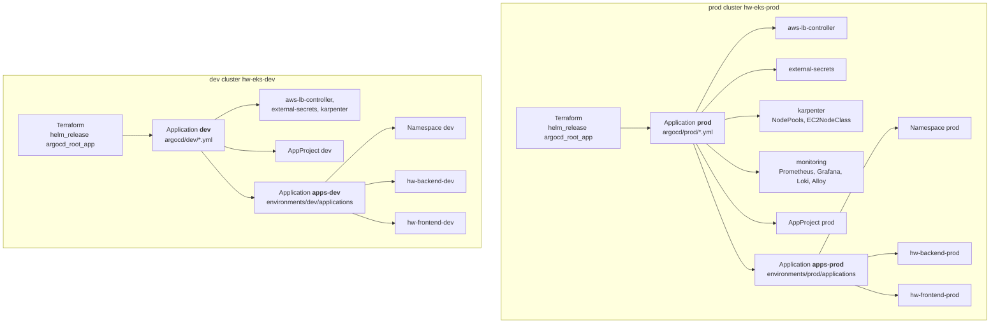

# k8s-envs

GitOps repository: the desired state of everything **inside** the EKS cluster. [Argo CD](https://argo-cd.readthedocs.io/)
watches this repo and keeps the cluster in sync with it (auto-sync, prune, self-heal): a change here is a
deploy, and a manual change in the cluster is reverted.

It holds two environments, **dev** and **prod**. Each runs in its **own EKS cluster** with its **own Argo CD**;
both read this one repository, each only its own folders.

Part of a three-repo setup; the overview (architecture, setup from zero, decisions) is in the
[terraform repo's README](https://github.com/jelicki-jovan/terraform):

| Repository | Owns |
|---|---|
| [app](https://github.com/jelicki-jovan/Incode-conduit-realworld-example-app) | App code, Dockerfiles, CI: builds images, pushes to ECR, bumps the image tag **here** |
| [terraform](https://github.com/jelicki-jovan/terraform) | AWS + cluster bootstrap: installs Argo CD and creates the root Application pointing at this repo |
| **k8s-envs** (this repo) | Add-ons, monitoring and the apps, all synced by Argo CD |

## How Argo CD is wired (app of apps)



- **Terraform creates only one Application per cluster**, the root app (`prod` / `dev`). It syncs every
  top-level `*.yml` in `argocd/<env>/`, and each of those is itself an Application (the "app of apps"
  pattern). Everything else in the cluster follows from Git: no manual `kubectl apply` after the Terraform
  apply.
- **Each cluster's Argo CD reads only its own folders** (`argocd/<env>/`, `environments/<env>/`): a change
  for dev can't reach prod, and the other way round.
- **Platform add-ons** (`argocd/<env>/`): upstream Helm charts with pinned versions, values from this repo
  (Argo CD multi-source: chart + `$values/...values.yml`).
- **Business apps** (`environments/<env>/`): the bridge Application `apps-<env>` syncs one Application per
  app, each pointing at a Kustomize overlay.

## Layout

```
argocd/prod/                       platform, synced by the root app "prod"
├── apps.yml                       → apps-prod (bridge to environments/prod/applications)
├── project.yml                    → AppProject prod (limits what business apps may do)
├── aws-lb-controller.yml  + aws-lb-controller/values.yml     chart 3.5.0
├── external-secrets.yml   + external-secrets/                chart 2.11.0 + per-namespace SecretStores
├── karpenter.yml          + karpenter/                       NodePools (spot, on-demand) + EC2NodeClass
└── monitoring.yml         + monitoring/                      kube-prometheus-stack 91.8.1, loki 7.3.0,
                                                              alloy 1.13.0, gp3 StorageClass
argocd/dev/                        platform of the dev cluster, synced by its root app "dev":
                                   apps.yml, project.yml, aws-lb-controller, external-secrets,
                                   karpenter (spot NodePool only); no monitoring
environments/prod/
├── applications/                  synced by apps-prod
│   ├── namespace.yml              → Namespace prod (Pod Security "restricted")
│   ├── backend.yml                → Application hw-backend-prod
│   └── frontend.yml               → Application hw-frontend-prod
└── overlays/
    ├── backend/                   Deployment, Service, HPA, PDB, ServiceAccount, ExternalSecrets,
    │                              migration Job, ConfigMap (generated), image tag
    └── frontend/                  Deployment, Service, Ingress (→ ALB), PDB, ServiceAccount,
                                   nginx /api proxy config, image tag
environments/dev/                  same structure as prod: applications/ (namespace dev, hw-*-dev) and
                                   overlays/ (1 replica, no HPA / PDB / spread rules, ALB hw-alb-dev)
```

Naming: Kubernetes objects of the business apps are `hw-<app>-<env>`; file and folder names stay plain
(`overlays/backend/`).

## Dev vs. prod

Dev is deliberately small: it's where every change lands first and where the performance test runs.

| | prod | dev |
|---|---|---|
| Replicas | backend 3-6 (HPA), frontend 3 | 1 each, no HPA |
| PDB, topology spread rules | yes | no (nothing to spread with 1 replica) |
| Karpenter NodePools | spot + on-demand, at least one replica on on-demand | spot only |
| Monitoring | Prometheus, Alertmanager, Grafana, Loki, Alloy | none |
| Add-on replicas (LB Controller, External Secrets) | 2, with PDBs | 1 |
| **The same** | images (same digest), probes, security context, Pod Security "restricted", IAM database auth, secrets via External Secrets, sync waves and migration Job | |

## Guardrails

- **AppProject `prod`**: business apps may deploy only from this repo, only into the namespace `prod`, and no
  cluster-wide objects. A mistake in an app's manifests can't touch add-ons or other namespaces.
- **Pod Security "restricted"** on the `prod` namespace: containers must run as non-root, drop all Linux
  capabilities, no privilege escalation, seccomp on. (The `monitoring` namespace is "privileged": node-exporter
  and Alloy need host access to read node metrics and log files.)
- **Secrets never in Git**: `ExternalSecret`s point at AWS Secrets Manager; External Secrets creates the
  Kubernetes Secrets. Each namespace has its own SecretStore with its own IAM role that can read only
  `<namespace>/*` secrets.

## How a deploy arrives

1. The app repo's CI builds the image once, pushes it to the dev ECR repository and commits the new tag for
   **dev** (`environments/dev/overlays/<app>/kustomization.yml` → `images.newTag`, commit
   `deploy(<app>): dev <sha>`).
2. After the performance test on dev passed, CI copies the same image to the prod repository and commits the
   tag for **prod** (`deploy(<app>): prod <sha>`).
3. In each cluster, Argo CD notices its commit (polls every 30 s) and syncs the app, in **sync waves**:

   | Wave | What |
   |---|---|
   | -2 | ServiceAccount, ConfigMap, ExternalSecrets (config and secrets exist first) |
   | -1 | **Migration Job** (backend only, Argo CD sync hook): runs pending DB migrations once; if it fails, the sync stops and the old pods keep serving |
   | 0 | Deployment, Service, HPA, PDB, Ingress |
4. **Rolling update** without downtime: one extra pod at a time (`maxSurge: 1`, `maxUnavailable: 0`), a new
   pod gets traffic only when its readiness probe passes, old pods get 10 s to be taken out of the load
   balancer before they stop.

**Rollback** = `git revert` of the tag commit, per environment. Changing things with `kubectl` doesn't
stick: self-heal reverts it.

## Apps

| | Backend | Frontend |
|---|---|---|
| What | Node.js API (`/api`) | nginx serving the React build + proxying `/api` to the backend |
| Replicas | 3-6 (HPA on CPU, 70%) | 3 (fixed: nginx is cheap, the replicas are for availability) |
| Exposed | only inside the cluster (no Ingress) | ALB via Ingress (AWS Load Balancer Controller, `target-type: ip`) |
| Database | as `app_user`, IAM auth (token from the pod's IAM role, no password) | – |
| Secrets | JWT key (ExternalSecret); master DB credentials only for the migration Job | none |

**Placement** (both apps): three topology spread rules keep the replicas even over **3 AZs**, over
**on-demand and spot** (at least one replica always on on-demand) and over **nodes**; spread is counted per
rollout revision, so a deploy always ends balanced. A **PodDisruptionBudget** (`minAvailable: 2`) keeps two
replicas up during node drains, Karpenter consolidation and upgrades.

**Probes**: liveness never checks the database (a short DB outage mustn't restart every pod); readiness
does, so pods leave the load balancer while the DB is unreachable.

## Platform add-ons

| App | What | Notes |
|---|---|---|
| `aws-lb-controller` | Creates the ALB from the frontend's Ingress | IRSA role from Terraform |
| `external-secrets` | Syncs AWS Secrets Manager → Kubernetes Secrets | One SecretStore + IAM role per namespace |
| `karpenter` | NodePools `spot` and `on-demand`, EC2NodeClass | Controller installed by Terraform; here only the node configuration. t3/t3a small/medium, 3 AZs, AMI pinned, consolidation after 10 min |
| `monitoring` | Prometheus, Alertmanager, Grafana, Loki, Alloy, encrypted gp3 StorageClass | One Application, 3 charts + manifests; details below |

### Monitoring

- **Metrics**: kube-prometheus-stack (Prometheus 15 days on a 20 GB encrypted volume, ~130 default alert
  rules, Grafana with Prometheus / Loki / CloudWatch data sources).
- **Logs**: Alloy (on every node) reads all pod logs and ships them to Loki, which stores them in S3 for
  30 days.
- **Alerts**: Alertmanager → SNS → email (warning and critical); an always-firing heartbeat feeds the dead
  man's switch alarm in CloudWatch.
- **Access**: no public UI:
  `kubectl -n monitoring port-forward svc/kube-prometheus-stack-grafana 3000:80` → http://localhost:3000
  (user `admin`, password in the Secret `kube-prometheus-stack-grafana`).

## Adding a new app

Per environment (dev and prod):

1. `environments/<env>/overlays/<app>/`: manifests + `kustomization.yml` (with `images.newTag`); follow the
   backend/frontend patterns (probes, resources, security context, and for prod spread rules and PDB).
2. `environments/<env>/applications/<app>.yml`: an Application `hw-<app>-<env>` in project `<env>`, pointing
   at the overlay.
3. AWS side (ECR repositories, IAM roles, secrets `<env>/<app>`) in the terraform repo.
4. CI in the app's repo: build once, deploy to dev, performance test, promote to prod (the same reusable
   workflows and actions as backend/frontend).

Commit and push: `apps-<env>` picks up the new Application, which then deploys the app.

## With more environments: a shared base

With dev and prod, most manifests are already duplicated: the Service, the probes and security context of
the Deployment, the migration Job, the nginx proxy config. Copying them per environment means every fix has
to be repeated (and eventually isn't).

I'd move those into a separate **`k8s-base` repository** and keep only what really differs per environment
here:

| `k8s-base` (shared, versioned) | `k8s-envs/environments/<env>/overlays/<app>` (per environment) |
|---|---|
| Deployment skeleton (probes, security context, spread rules, graceful shutdown), Service, PDB, migration Job | image tag, replicas / HPA limits, resources, config values, IAM role annotations, Ingress host |

Each overlay pulls the base **pinned to a tag or commit** and patches it (Kustomize remote base):

```yaml
# environments/prod/overlays/backend/kustomization.yml
resources:
  - https://github.com/jelicki-jovan/k8s-base//apps/backend?ref=v1.4.0
patches:
  - path: deployment-patch.yml   # prod-specific: resources, env
images:
  - name: backend
    newTag: c287398
```

- **Pinned**: a change in the base reaches an environment only when its `ref` is bumped, so a base change
  can go to dev first and to prod after it's proven, like an image.
- **Reviewed once**: base changes are reviewed in one place; environment repos only review the diff of
  their own values.
