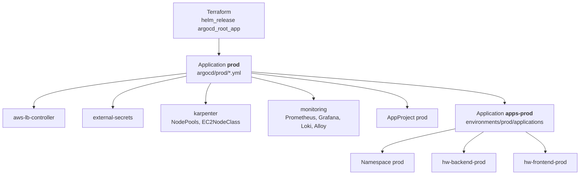

# k8s-envs

GitOps repository: the desired state of everything **inside** the EKS cluster. [Argo CD](https://argo-cd.readthedocs.io/)
watches this repo and keeps the cluster in sync with it (auto-sync, prune, self-heal): a change here is a
deploy, and a manual change in the cluster is reverted.

Part of a three-repo setup; the overview (architecture, setup from zero, decisions) is in the
[terraform repo's README](https://github.com/jelicki-jovan/terraform):

| Repository | Owns |
|---|---|
| [app](https://github.com/jelicki-jovan/Incode-conduit-realworld-example-app) | App code, Dockerfiles, CI: builds images, pushes to ECR, bumps the image tag **here** |
| [terraform](https://github.com/jelicki-jovan/terraform) | AWS + cluster bootstrap: installs Argo CD and creates the root Application pointing at this repo |
| **k8s-envs** (this repo) | Add-ons, monitoring and the apps, all synced by Argo CD |

## How Argo CD is wired (app of apps)



- **Terraform creates only one Application**, the root app `prod`. It syncs every top-level `*.yml` in
  `argocd/prod/`, and each of those is itself an Application (the "app of apps" pattern). Everything else in
  the cluster follows from Git: no manual `kubectl apply` after the Terraform apply.
- **Platform add-ons** (`argocd/prod/`): upstream Helm charts with pinned versions, values from this repo
  (Argo CD multi-source: chart + `$values/...values.yml`).
- **Business apps** (`environments/prod/`): the bridge Application `apps-prod` syncs one Application per app,
  each pointing at a Kustomize overlay.

## Layout

```
argocd/prod/                       platform, synced by the root app "prod"
├── apps.yml                       → apps-prod (bridge to environments/prod/applications)
├── project.yml                    → AppProject prod (limits what business apps may do)
├── aws-lb-controller.yml  + aws-lb-controller/values.yml     chart 3.5.0
├── external-secrets.yml   + external-secrets/                chart 2.11.0 + per-namespace SecretStores
├── karpenter.yml          + karpenter/                       NodePools (spot, on-demand) + EC2NodeClass
└── monitoring.yml         + monitoring/                      kube-prometheus-stack 91.8.1, loki 7.3.0,
                                                              alloy 1.13.0, gp3 StorageClass
environments/prod/
├── applications/                  synced by apps-prod
│   ├── namespace.yml              → Namespace prod (Pod Security "restricted")
│   ├── backend.yml                → Application hw-backend-prod
│   └── frontend.yml               → Application hw-frontend-prod
└── overlays/
    ├── backend/                   Deployment, Service, HPA, PDB, ServiceAccount, ExternalSecrets,
    │                              migration Job, ConfigMap (generated), image tag
    └── frontend/                  Deployment, Service, Ingress (→ ALB), PDB, ServiceAccount,
                                   nginx /api proxy config, image tag
```

Naming: Kubernetes objects of the business apps are `hw-<app>-prod`; file and folder names stay plain
(`overlays/backend/`).

## Guardrails

- **AppProject `prod`**: business apps may deploy only from this repo, only into the namespace `prod`, and no
  cluster-wide objects. A mistake in an app's manifests can't touch add-ons or other namespaces.
- **Pod Security "restricted"** on the `prod` namespace: containers must run as non-root, drop all Linux
  capabilities, no privilege escalation, seccomp on. (The `monitoring` namespace is "privileged": node-exporter
  and Alloy need host access to read node metrics and log files.)
- **Secrets never in Git**: `ExternalSecret`s point at AWS Secrets Manager; External Secrets creates the
  Kubernetes Secrets. Each namespace has its own SecretStore with its own IAM role that can read only
  `<namespace>/*` secrets.

## How a deploy arrives

1. The app repo's CI pushes an image to ECR, then commits the new tag here
   (`environments/prod/overlays/<app>/kustomization.yml` → `images.newTag`, commit
   `deploy(<app>): prod <sha>`).
2. Argo CD notices the commit (polls every 30 s) and syncs the app, in **sync waves**:

   | Wave | What |
   |---|---|
   | -2 | ServiceAccount, ConfigMap, ExternalSecrets (config and secrets exist first) |
   | -1 | **Migration Job** (backend only, Argo CD sync hook): runs pending DB migrations once; if it fails, the sync stops and the old pods keep serving |
   | 0 | Deployment, Service, HPA, PDB, Ingress |
3. **Rolling update** without downtime: one extra pod at a time (`maxSurge: 1`, `maxUnavailable: 0`), a new
   pod gets traffic only when its readiness probe passes, old pods get 10 s to be taken out of the load
   balancer before they stop.

**Rollback** = `git revert` of the tag commit. Changing things with `kubectl` doesn't stick: self-heal
reverts it.

## Apps

| | Backend | Frontend |
|---|---|---|
| What | Node.js API (`/api`) | nginx serving the React build + proxying `/api` to the backend |
| Replicas | 3-6 (HPA on CPU, 70%) | 3 (fixed: nginx is cheap, the replicas are for availability) |
| Exposed | only inside the cluster (no Ingress) | ALB via Ingress (AWS Load Balancer Controller, `target-type: ip`) |
| Database | as `app_user`, IAM auth (token from the pod's IAM role, no password) | – |
| Secrets | JWT key (ExternalSecret); master DB credentials only for the migration Job | none |

**Placement** (both apps): three topology spread rules keep the replicas even over **3 AZs**, over
**on-demand and spot** (at least one replica always on on-demand) and over **nodes**; spread is counted per
rollout revision, so a deploy always ends balanced. A **PodDisruptionBudget** (`minAvailable: 2`) keeps two
replicas up during node drains, Karpenter consolidation and upgrades.

**Probes**: liveness never checks the database (a short DB outage mustn't restart every pod); readiness
does, so pods leave the load balancer while the DB is unreachable.

## Platform add-ons

| App | What | Notes |
|---|---|---|
| `aws-lb-controller` | Creates the ALB from the frontend's Ingress | IRSA role from Terraform |
| `external-secrets` | Syncs AWS Secrets Manager → Kubernetes Secrets | One SecretStore + IAM role per namespace |
| `karpenter` | NodePools `spot` and `on-demand`, EC2NodeClass | Controller installed by Terraform; here only the node configuration. t3/t3a small/medium, 3 AZs, AMI pinned, consolidation after 10 min |
| `monitoring` | Prometheus, Alertmanager, Grafana, Loki, Alloy, encrypted gp3 StorageClass | One Application, 3 charts + manifests; details below |

### Monitoring

- **Metrics**: kube-prometheus-stack (Prometheus 15 days on a 20 GB encrypted volume, ~130 default alert
  rules, Grafana with Prometheus / Loki / CloudWatch data sources).
- **Logs**: Alloy (on every node) reads all pod logs and ships them to Loki, which stores them in S3 for
  30 days.
- **Alerts**: Alertmanager → SNS → email (warning and critical); an always-firing heartbeat feeds the dead
  man's switch alarm in CloudWatch.
- **Access**: no public UI:
  `kubectl -n monitoring port-forward svc/kube-prometheus-stack-grafana 3000:80` → http://localhost:3000
  (user `admin`, password in the Secret `kube-prometheus-stack-grafana`).

## Adding a new app

1. `environments/prod/overlays/<app>/`: manifests + `kustomization.yml` (with `images.newTag`); follow the
   backend/frontend patterns (probes, resources, security context, spread rules, PDB).
2. `environments/prod/applications/<app>.yml`: an Application `hw-<app>-prod` in project `prod`, pointing at
   the overlay.
3. AWS side (ECR repository, IAM role, secrets `prod/<app>`) in the terraform repo.
4. CI in the app's repo: build, push to ECR, bump `newTag` here.

Commit and push: `apps-prod` picks up the new Application, which then deploys the app.
